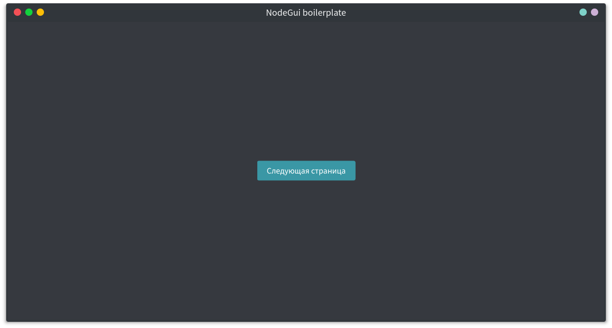

# NodeGui boilerplate

A boilerplate desktop project that includes:
 - NodeGui
 - SCSS support
 - TypeScript
 - i18n and localization files
 - Multi-platform deployment support
 - ESLint rules
 - GitHub Actions configuration
 - Config files support
 - Application message bus



Node.JS v12+ is required to build.

## Installing from sources
```bash
git clone https://github.com/ruslang02/nodegui-boilerplate
cd nodegui-boilerplate/
npm install
npm start
```

## Configuration
File `~/.config/nodegui-boilerplate-nodejs/config.json` is responsible for app configuration.

## License
GPL 3.0

## Third-party
 - [NodeGui](https://github.com/nodegui/nodegui)
 - [Qt](https://www.qt.io/)
 - [Packer](https://github.com/nodegui/packer)
